<div align="center">

# ⛏️ Pixel Mining Simulator

Stop using boring green grids. This GitHub Action hijacks your contribution heatmap and turns it into a literal 2D mining operation. A custom vector miner walks across your profile, harvesting your high-commit days like rare ores.

---

## 📺 Live Preview



---

## 📦 Setup

No complex configuration needed. It runs completely automated via GitHub Actions.

### 1. Add the Workflow
Create a file named `.github/workflows/mine.yml` in your profile repository and drop this inside:

```yaml
name: Run Pixel Miner

on:
  schedule:
    - cron: "0 */12 * * *"
  workflow_dispatch:

jobs:
  mine:
    runs-on: ubuntu-latest
    steps:
      - uses: actions/checkout@v3
      - uses: actions/setup-node@v3
        with:
          node-version: 18
      - run: node index.js
      - uses: stefanzweifel/git-auto-commit-action@v4
        with:
          commit_message: "Miner secured more ores"
          file_pattern: "mining-grid.svg"
